---
## Front matter
lang: ru-RU
title: Установка и конфигурация операционной системы на виртуальную машину
author: Назарьева Алена НФИбд-03-18
institute:
	inst{1}RUDN University, Moscow, Russian Federation
date: 2021, 14 september
## Formatting
toc: false
slide_level: 2
theme: metropolis
header-includes:
 - \metroset{progressbar=frametitle,sectionpage=progressbar,numbering=fraction}
 - '\makeatletter'
 - '\beamer@ignorenonframefalse'
 - '\makeatother'
aspectratio: 43
section-titles: true
---
# Цель работы

Приобретение практических навыков установки операционной системы на виртуальную машину, настройки минимально необходимых для дальнейшей работы сервисов.

# Выполнение лабораторной работы

## 1)
Запустила виртуальную машину, введя VirtualBox в командной строке. (рис. -@fig:001)

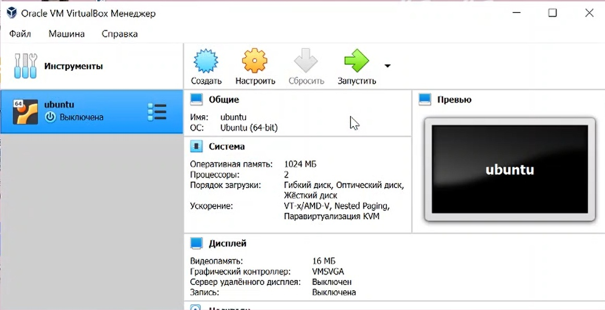{ #fig:001 width=70% }
## 2)
Создала новую виртуальную машину. Для этого в VirtualBox выбрала
Машина->Создать. (рис. -@fig:003)

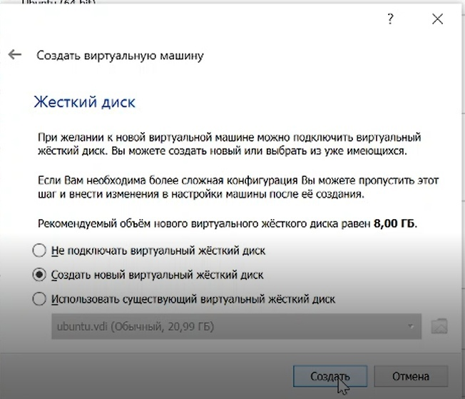{ #fig:003 width=70% }
## 3)
Указала имя виртуальной машины — Centos, тип операционной системы
— Linux, RedHat. Указала размер основной памяти виртуальной
машины — 1024 МБ (рис. -@fig:007)

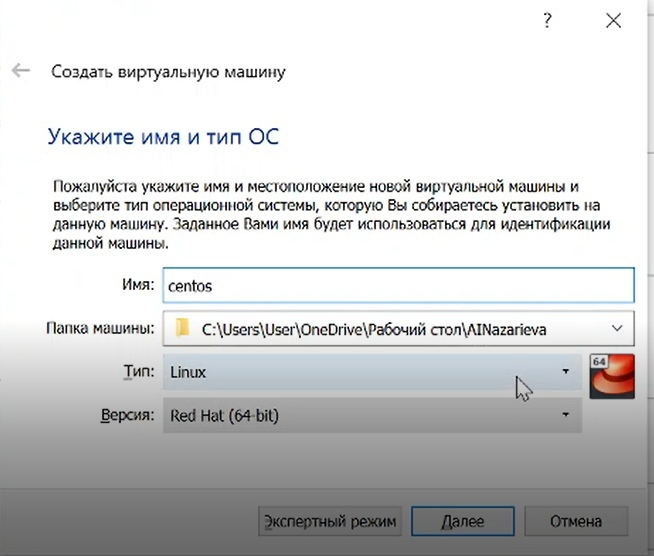{ #fig:007 width=70% }
## 4)
Изменила хост-комбинацию на Menu (рис. -@fig:002)

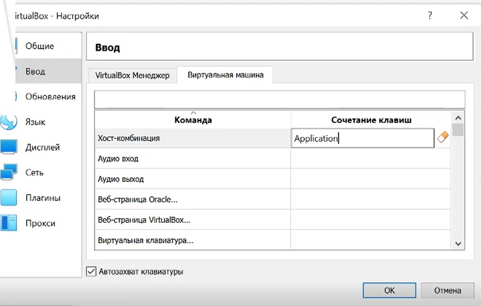{ #fig:002 width=70% }
## 5)
Создала новую виртуальную машину. Для этого в VirtualBox выбрала
Машина->Создать.
Указала типа машины-VirtualBox Disk Image  (рис. -@fig:004)

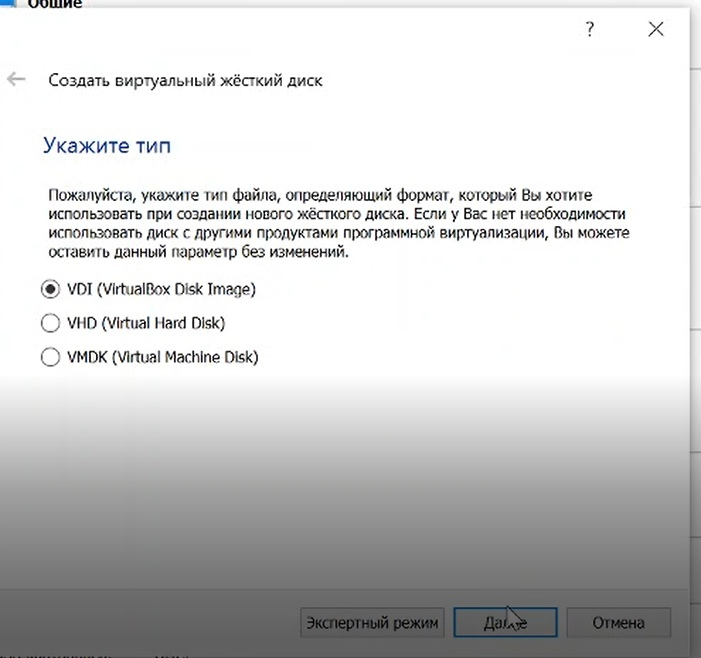{ #fig:004 width=70% }
## 6)
Указала формат хранения-динамический виртуальный жесткий диск  (рис. -@fig:005)

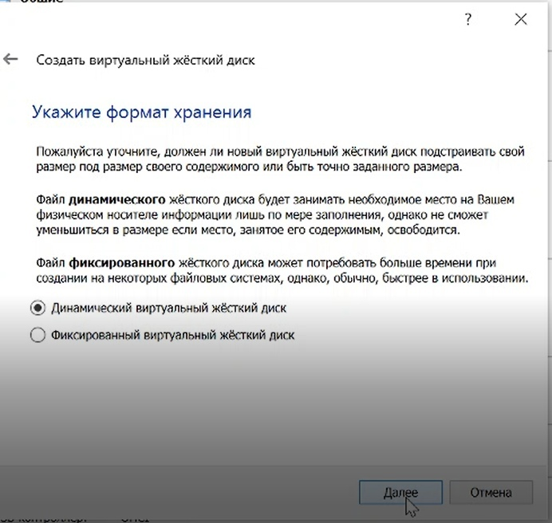{ #fig:005 width=70% }
## 7)
Задала размер диска — 20 ГБ, его расположение — в данном случае
C:\Users\User\AINazarieva\centos (рис. -@fig:006)

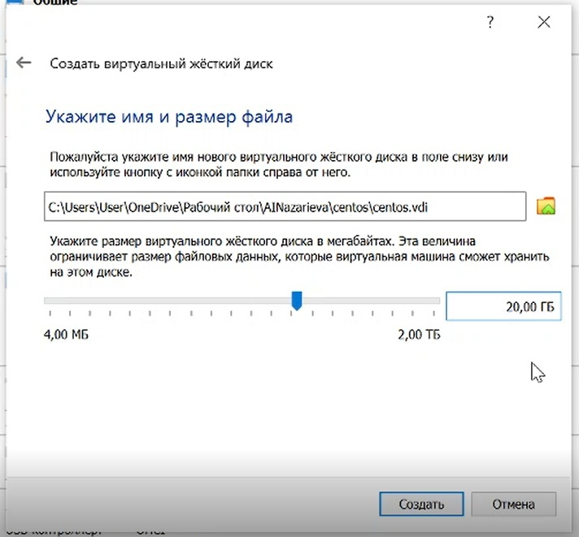{ #fig:006 width=70% }
## 8)
Выбрала в VirtualBox Свойства->Носители виртуальной машины Centos.
Добавить новый привод оптических дисков и выбрать образ
CentOS (рис. -@fig:008)

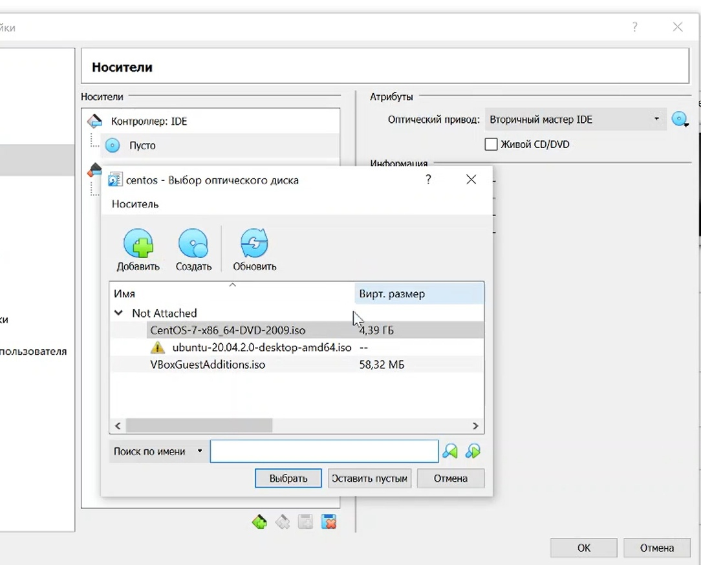{ #fig:008 width=70% }
## 9)

Результат работы программы (рис. -@fig:004)

{ #fig:004 width=70% }
## 10)
Запустила виртуальную машину (рис. -@fig:009)

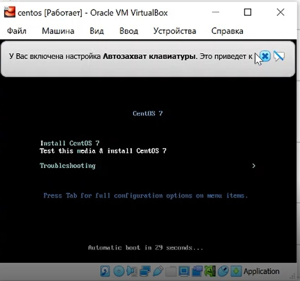{ #fig:009 width=70% }
## 11)
Установила русский язык для интерфейса (рис. -@fig:010)

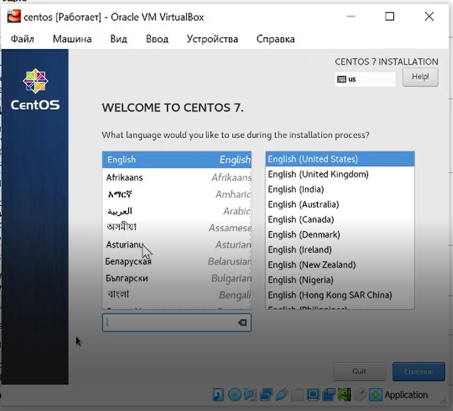{ #fig:010 width=70% }
## 12)
Указала часовой пояс «Москва» (рис. -@fig:011)

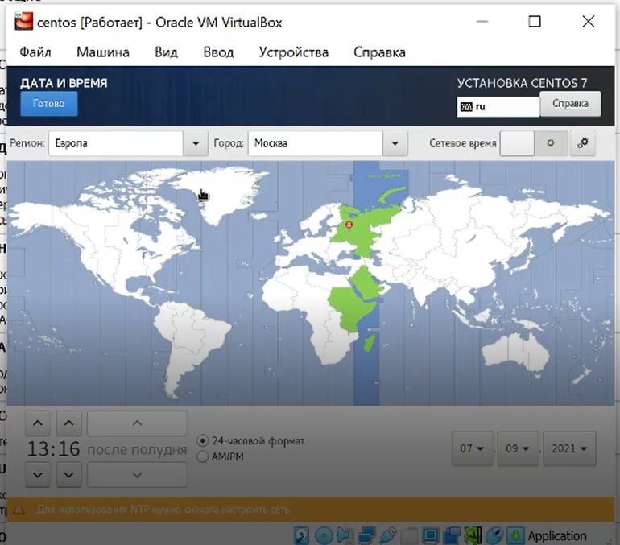{ #fig:011 width=70% }
## 13)
Выбрала раскладку клавиатуры англйискую (рис. -@fig:012)

{ #fig:012 width=70% }
## 14)
Выбрала программы (рис. -@fig:013)

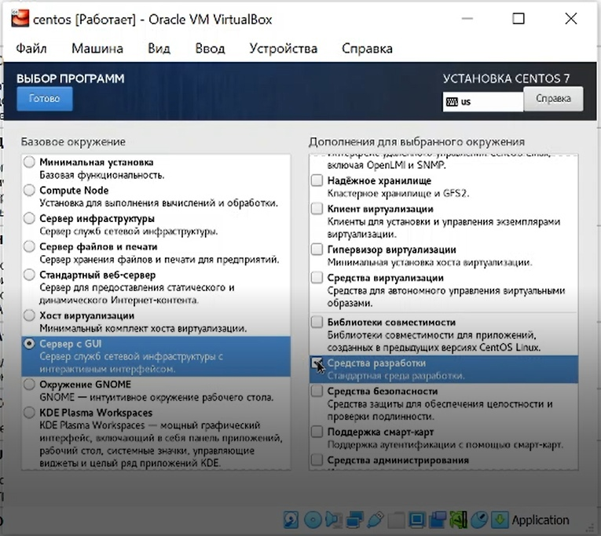{ #fig:013 width=70% }
## 15)
Выключила kdump (рис. -@fig:014)

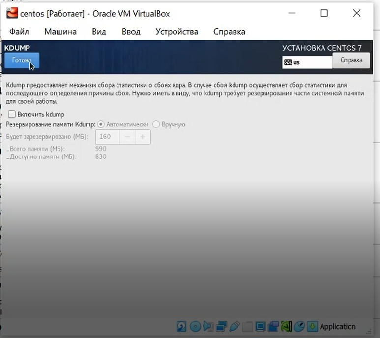{ #fig:014 width=70% }
## 16)
В качестве имени машины указала «ainazarieva.localdomain» и подключила ethernet (рис. -@fig:015)

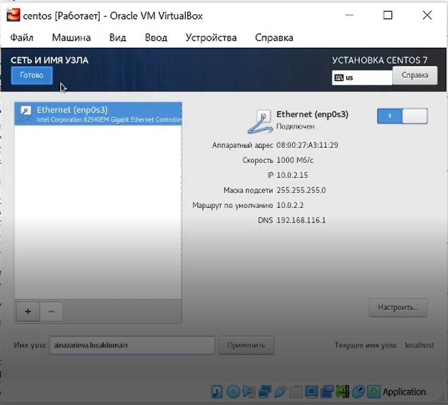{ #fig:015 width=70% }
## 17)
Установила пароль для root (рис. -@fig:016)

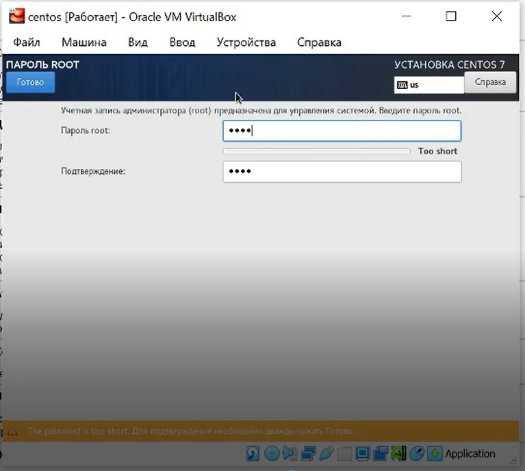{ #fig:016 width=70% }
## 18)
Создала пользователя ainazarieva (рис. -@fig:017)

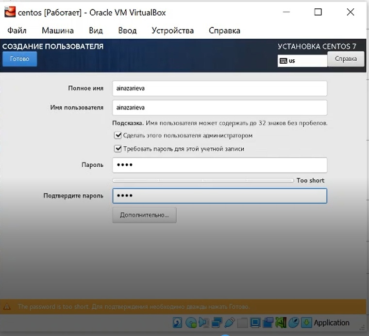{ #fig:017 width=70% }
## 19)
Принимаю лицензионное соглашение (рис. -@fig:018)

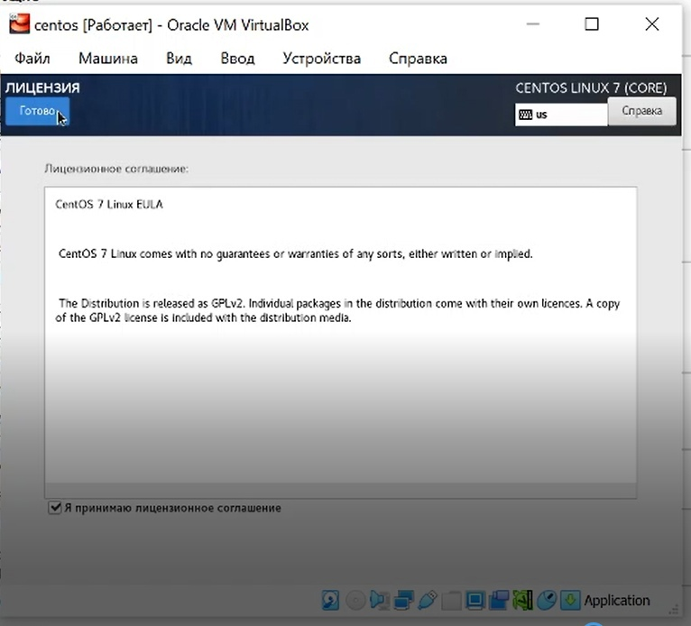{ #fig:018 width=70% }
## 20)
Подключиться к виртуальной машине с помощью созданной учётной
записи (рис. -@fig:019)

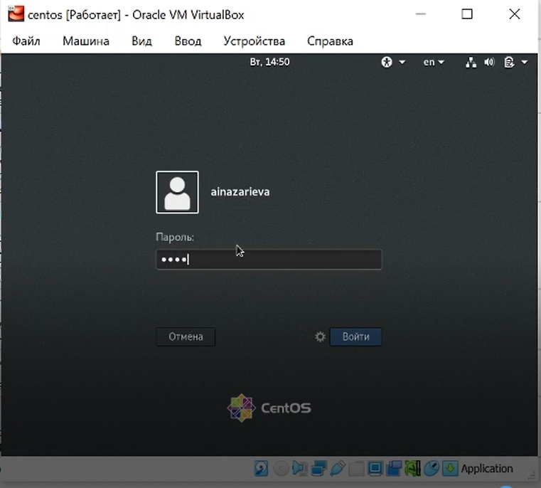{ #fig:019 width=70% }
## 21)
Через Устройства подключила образ диска Дополнений гостевой ОС(рис. -@fig:020)

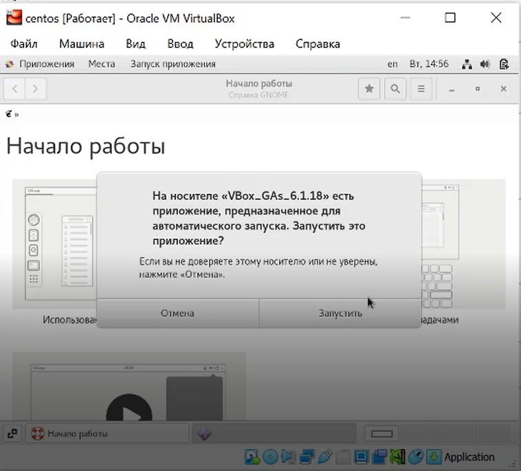{ #fig:020 width=70% }
## 22)
На виртуальной машине запустила терминал, перешла под учетную запись root с помощью команды su.
С помощью команды yum update обновила системные файлы и установила необходимые программы, например, mc:
yum update (рис. -@fig:021)
yum install mc (рис. -@fig:022)

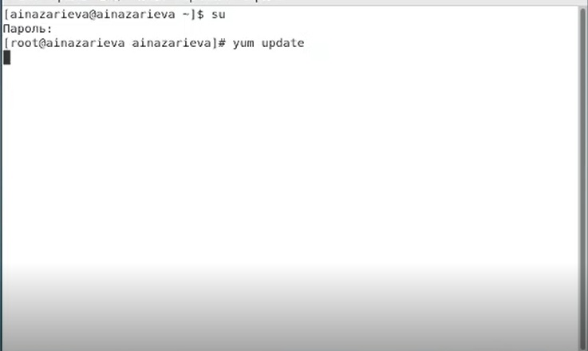{ #fig:021 width=70% }
## 23)
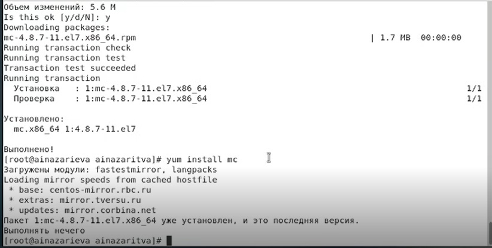{ #fig:022 width=70% }

# Выводы

В результате проделанной работы я Приобрела практические навыки установки операционной системы на виртуальную машину, настройки минимально необходимых для дальнейшей работы сервисов.
