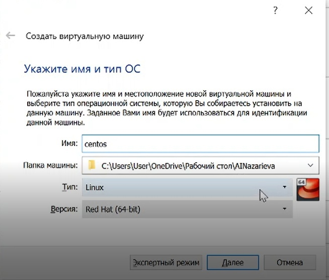
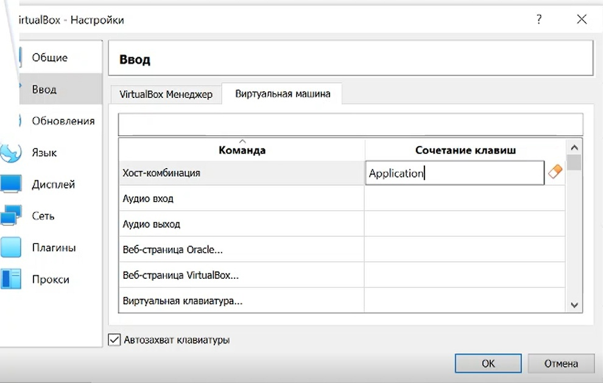
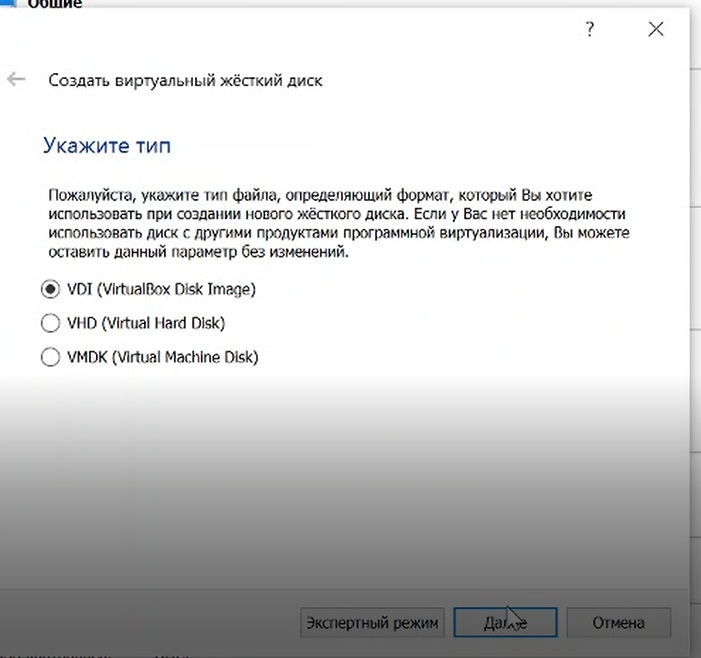
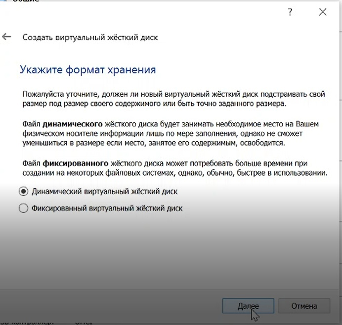
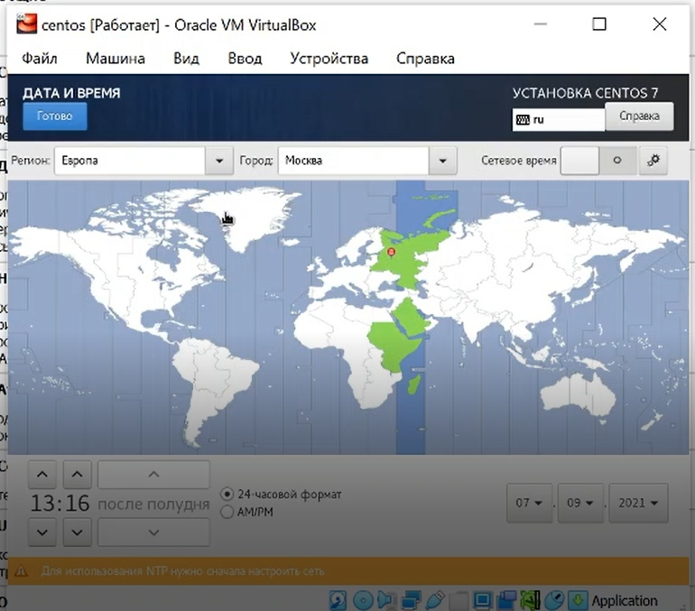
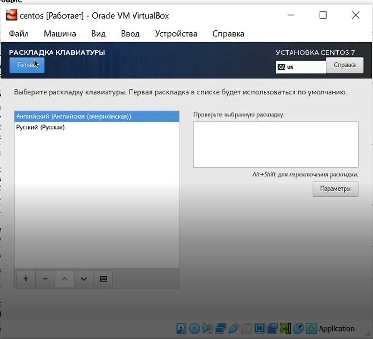
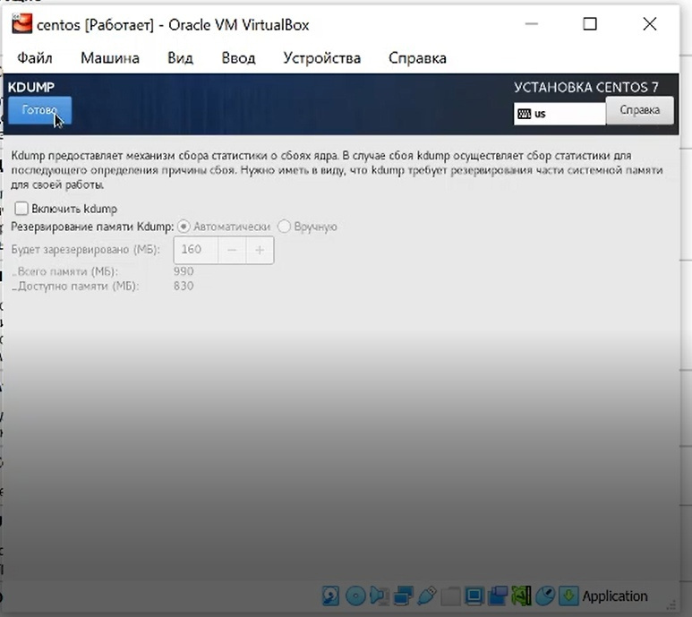
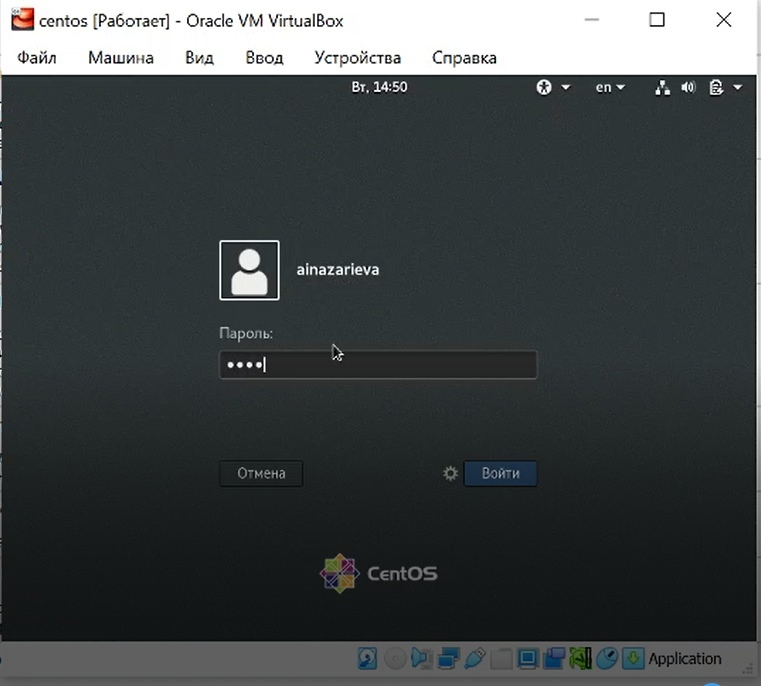
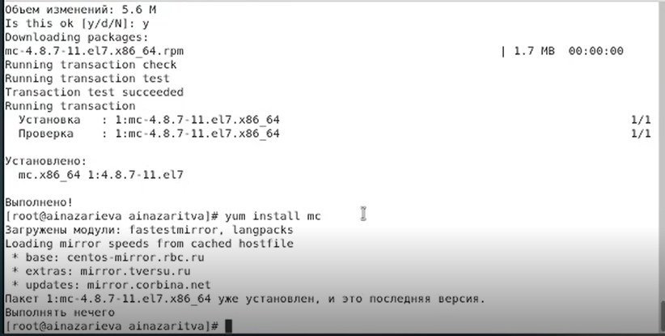

---
# Front matter
lang: ru-RU
title: "Oтчёт по лабораторной работе"
subtitle: "Установка и конфигурация операционной системы на виртуальную машину"
author: "Назарьева Алена Игоревна НФИбд-03-18"

# Formatting
toc-title: "Содержание"
toc: true # Table of contents
toc_depth: 2
lof: true # List of figures
lot: true # List of tables
fontsize: 12pt
linestretch: 1.5
papersize: a4paper
documentclass: scrreprt
polyglossia-lang: russian
polyglossia-otherlangs: english
mainfont: PT Serif
romanfont: PT Serif
sansfont: PT Sans
monofont: PT Mono
mainfontoptions: Ligatures=TeX
romanfontoptions: Ligatures=TeX
sansfontoptions: Ligatures=TeX,Scale=MatchLowercase
monofontoptions: Scale=MatchLowercase
indent: true
pdf-engine: lualatex
header-includes:
  - \linepenalty=10 # the penalty added to the badness of each line within a paragraph (no associated penalty node) Increasing the value makes tex try to have fewer lines in the paragraph.
  - \interlinepenalty=0 # value of the penalty (node) added after each line of a paragraph.
  - \hyphenpenalty=50 # the penalty for line breaking at an automatically inserted hyphen
  - \exhyphenpenalty=50 # the penalty for line breaking at an explicit hyphen
  - \binoppenalty=700 # the penalty for breaking a line at a binary operator
  - \relpenalty=500 # the penalty for breaking a line at a relation
  - \clubpenalty=150 # extra penalty for breaking after first line of a paragraph
  - \widowpenalty=150 # extra penalty for breaking before last line of a paragraph
  - \displaywidowpenalty=50 # extra penalty for breaking before last line before a display math
  - \brokenpenalty=100 # extra penalty for page breaking after a hyphenated line
  - \predisplaypenalty=10000 # penalty for breaking before a display
  - \postdisplaypenalty=0 # penalty for breaking after a display
  - \floatingpenalty = 20000 # penalty for splitting an insertion (can only be split footnote in standard LaTeX)
  - \raggedbottom # or \flushbottom
  - \usepackage{float} # keep figures where there are in the text
  - \floatplacement{figure}{H} # keep figures where there are in the text
---

# Цель работы

Приобретение практических навыков установки операционной системы на виртуальную машину, настройки минимально необходимых для дальнейшей работы сервисов.

# Выполнение лабораторной работы

1. Запустила виртуальную машину, введя VirtualBox в командной строке. (рис. -@fig:001)

{ #fig:001 width=70% }

Создала новую виртуальную машину. Для этого в VirtualBox выбрала
Машина->Создать. (рис. -@fig:003)

{ #fig:003 width=70% }

Указала имя виртуальной машины — Centos, тип операционной системы
— Linux, RedHat. Указала размер основной памяти виртуальной
машины — 1024 МБ (рис. -@fig:007)

{ #fig:007 width=70% }

Изменила хост-комбинацию на Menu (рис. -@fig:002)

{ #fig:002 width=70% }

Создала новую виртуальную машину. Для этого в VirtualBox выбрала
Машина->Создать.
Указала типа машины-VirtualBox Disk Image  (рис. -@fig:004)

{ #fig:004 width=70% }

Указала формат хранения-динамический виртуальный жесткий диск  (рис. -@fig:005)

{ #fig:005 width=70% }

Задала размер диска — 20 ГБ и его расположение (рис. -@fig:006)

{ #fig:006 width=70% }

Выбрала в VirtualBox Свойства->Носители виртуальной машины Centos.
Добавить новый привод оптических дисков и выбрать образ
CentOS (рис. -@fig:008)

{ #fig:008 width=70% }

2. Запустила виртуальную машину (рис. -@fig:009)

{ #fig:009 width=70% }

Установила русский язык для интерфейса (рис. -@fig:010)

{ #fig:010 width=70% }

Указала часовой пояс «Москва» (рис. -@fig:011)

{ #fig:011 width=70% }

Выбрала раскладку клавиатуры англйискую (рис. -@fig:012)

{ #fig:012 width=70% }

Выбрала программы (рис. -@fig:013)

{ #fig:013 width=70% }

Выключила kdump (рис. -@fig:014)

{ #fig:014 width=70% }

В качестве имени машины указала «ainazarieva.localdomain» и подключила ethernet (рис. -@fig:015)

{ #fig:015 width=70% }

Установила пароль для root (рис. -@fig:016)

{ #fig:016 width=70% }

Создала пользователя ainazarieva (рис. -@fig:017)

{ #fig:017 width=70% }

Принимаю лицензионное соглашение (рис. -@fig:018)

{ #fig:018 width=70% }

Подключиться к виртуальной машине с помощью созданной учётной
записи (рис. -@fig:019)

{ #fig:019 width=70% }

Через Устройства подключила образ диска Дополнений гостевой ОС(рис. -@fig:020)

{ #fig:020 width=70% }

На виртуальной машине запустила терминал, перешла под учетную запись root с помощью команды su.
С помощью команды yum update обновила системные файлы и установила необходимые программы, например, mc:
yum update (рис. -@fig:021)
yum install mc (рис. -@fig:022)

{ #fig:021 width=70% }

{ #fig:022 width=70% }

# Выводы

В результате проделанной работы я Приобрела практические навыки установки операционной системы на виртуальную машину, настройки минимально необходимых для дальнейшей работы сервисов.
